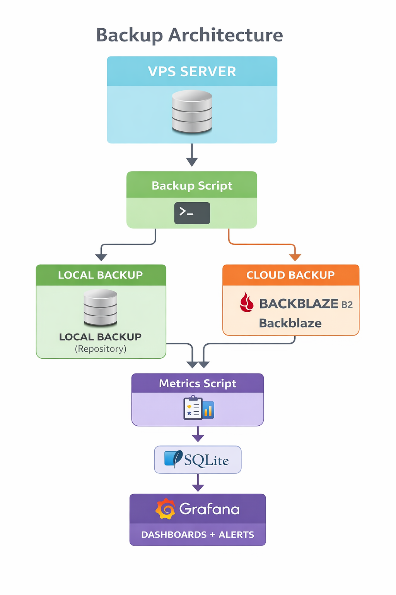
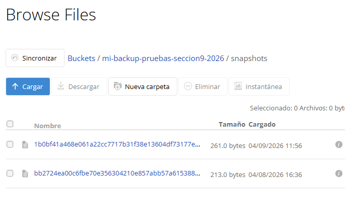
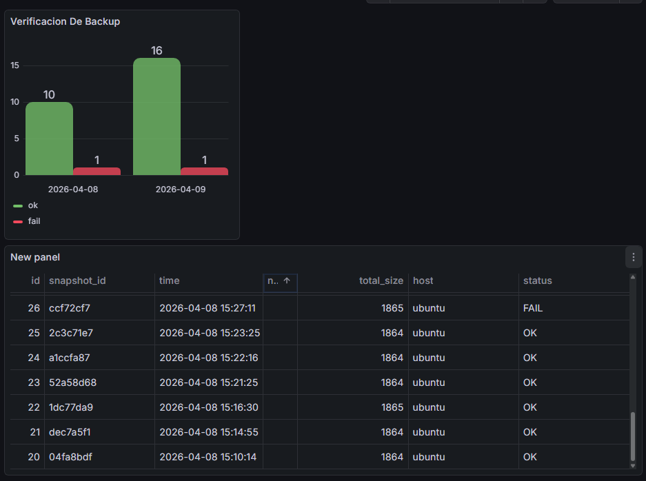
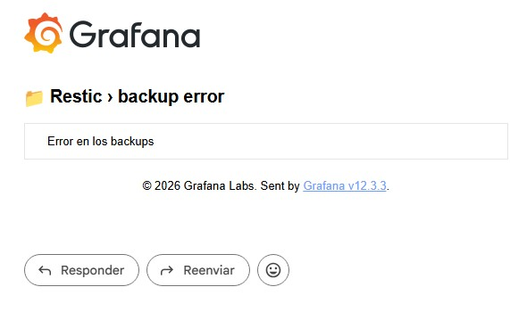

```text
=======================================
      SISTEMA DE BACKUP CON RESTIC
      LOCAL + NUBE BACKBLAZE B2
=======================================
```

Este sistema permite:

- Hacer backups locales en tu disco.
- Hacer backups en la nube (Backblaze B2).
- Mantener un historial de 14 días.
- Mantener backups INMUTABLES en B2 (Object Lock).
- Mantener una copia secundaria en MEGA.
- Registrar métricas en SQLite para Grafana.
- Restaurar archivos fácilmente.


---------------------------------------------------
1️⃣ PREPARAR BACKUPS LOCALES
---------------------------------------------------

1. Crear carpeta para los backups:
   mkdir -p /mnt/backups/restic-backups

2. Crear carpeta para logs:
   mkdir -p /var/log/restic

3. Crear archivo de variables .env:
   nano /home/.restic_env

   Ejemplo de contenido:
   # Repositorios
   RESTIC_REPOSITORY_LOCAL=/mnt/backups/restic-backups
   RESTIC_REPOSITORY_B2=b2:mi-backup-pruebas-seccion-9-2026

   # Credenciales
   RESTIC_PASSWORD="TuContraseñaSegura"
   B2_ACCOUNT_ID="tu_account_id"
   B2_ACCOUNT_KEY="tu_application_key"

4. Inicializar el repositorio (solo la primera vez):
   restic init

5. Verificar que Restic está instalado:
   restic version

---------------------------------------------------
2️⃣ SCRIPT DE BACKUP LOCAL
---------------------------------------------------

Archivo: restic-backup.sh

- Este script:
  - Hace backup de las carpetas indicadas.
  - Verifica integridad del repositorio.
  - Elimina snapshots antiguos según política (máx 14 días).
  - Guarda logs en /var/log/restic/restic-backup.log
  - Dar permisos de ejecución:
    chmod +x /home/restic-backup.sh

---------------------------------------------------
3️⃣ PROGRAMAR BACKUPS AUTOMÁTICOS
---------------------------------------------------

- Editar crontab:
  crontab -e

- Agregar backup todos los dias a las 12:
  0 0 * * * /bin/bash /home/restic-backup.sh

- Crear archivo /etc/logrotate.d/restic
  /var/log/restic/restic-backup.log {
    daily
    rotate 7
    missingok
    notifempty
    compress
    copytruncate
}

---------------------------------------------------
4️⃣ RESTAURACIÓN DE BACKUPS
---------------------------------------------------
Archivo: restic-restore.sh

- Ver snapshots disponibles:
  restic snapshots

- Restaurar en carpeta temporal:
  restic restore <ID_DEL_SNAPSHOT> --target /tmp/restic-restore

- Restaurar en la ruta original (sobrescribe archivos):
  restic restore <ID_DEL_SNAPSHOT> --target /

- También se puede usar el script interactivo de restauración, que permite elegir snapshot y carpeta destino

Archivo: restic-restore-test.sh
 - Busca el último snapshot disponible en el repositorio de restic
 - Restaura ese snapshot en una carpeta temporal (/tmp/restic-restore-test)
 - Verifica que la restauración se ha realizado correctamente
 - Registra el resultado en un log
---------------------------------------------------
5️⃣ BACKUP EN LA NUBE BACKBLAZE B2
---------------------------------------------------

1. Definir conexión a B2 y contraseña en el .env:
   export RESTIC_REPOSITORY=b2:mi-backup-pruebas-seccion-9-2026
   export B2_ACCOUNT_ID="tu_account_id"
   export B2_ACCOUNT_KEY="tu_application_key"
   export RESTIC_PASSWORD="TuContraseñaSegura"

2. Inicializar repositorio en B2 (solo una vez):
   restic init

3. Script de backup local + nube (restic-backup-local+nube.sh):


---------------------------------------------------
6️⃣ COPIA ADICIONAL EN MEGA (BACKUP SECUNDARIO)
---------------------------------------------------

Se mantiene una copia adicional en MEGA como respaldo extra.

Características:

- 20 GB gratuitos aprox.
- Copia secundaria de seguridad
- Complementa B2

---------------------------------------------------
7️⃣ MÉTRICAS Y MONITOREO
---------------------------------------------------

- El script restic-metrics.sh guarda:
  - snapshot_id
  - fecha y hora
  - número de archivos
  - tamaño total
  - host
  - estado del backup (OK/FAIL)
  
- Guardado en SQLite para visualización en Grafana.
- En Grafana:
  1. Configura Data Source SQLite apuntando a la base de datos.
  2. Crea paneles con métricas de backup.

Para recibir un correo cuando falle un backup:
  - Nota: Desde Gmail necesitas un **App Password** si tienes verificación en 2 pasos.


- Alerta si hay un fallo de backup:


---------------------------------------------------
RESUMEN DE PASOS
---------------------------------------------------

- Backup local en VPS
- Backup en Backblaze B2 (INMUTABLE 14 días)
- Backup en MEGA (copia secundaria)
- Retención automática de 14 días
- Protección contra ransomware
- Monitoreo con Grafana
- Restauración rápida de snapshots

---------------------------------------------------
FIN DEL MANUAL
---------------------------------------------------